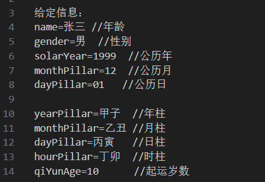
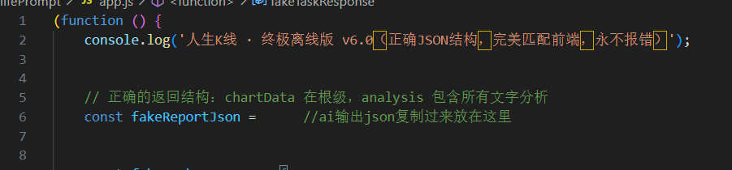

# LifeKline.cn 优化工具：跳过排队，直接生成命理报告

这个项目提供一个手动方法，帮助你在 https://www.lifekline.cn/ 网站上快速生成完整命理报告，彻底解决排队等待、生成失败、卡顿等问题。

**核心优势**：
- 无需排队，直接秒出报告
- 注入完整 JSON，内容更稳定、可控
- 强烈推荐使用 Gemini 3 Pro生成报告，准确度和细节远超网站默认模型
- 纯手动操作，无需安装任何插件（理性娱乐，别破防😂）

## 使用步骤

### 第一步：准备提示词（Prompt）
打开项目中的 `prompt.txt` 文件，按照格式填写你的个人信息（姓名、性别、生日、出生时间、出生地点等）。


推荐八字排盘网站：https://p.china95.com/bazi/  
填写生日后，“第一个大运下面的年龄”就是起运时间，记得填进 Prompt。


### 第二步：生成并处理报告 JSON
1. 把 `prompt.txt` 里的内容复制到 Gemini（或其他强模型）中，让它生成命理报告。
2. 要求模型输出**完整 JSON 格式**的报告。
3. 复制生成的完整 JSON，粘贴到 `app.js` 文件中的 `fakeReportJson` 变量里（替换原有内容）。

```javascript
const fakeReportJson = {
  // 这里粘贴你从 Gemini 生成的完整 JSON
};
```

  


### 第三步：注入到网站
1. 打开浏览器，访问 https://www.lifekline.cn/
2. 按 F12（或右键 → 检查）打开开发者工具，切换到 **Console**（控制台）标签
3. 复制 `app.js` 文件的**全部内容**
4. 粘贴到控制台中，按回车执行


5. 回到网站页面，随便填写姓名、生日等信息（内容不影响最终结果）
6. 点击“生成报告”按钮

结果：瞬间跳过所有等待，直接显示完整、详细的命理报告！


## 注意事项
- 这是一个手动辅助工具，非自动化脚本，不违反网站规则。
- 报告内容仅供娱乐参考，请理性看待。
- 如果报告效果不理想，可多次优化 Prompt（比如要求模型“更详细”“更专业”）。
- `app.js` 仅为模板，每次生成新报告后记得替换 JSON。

## 贡献与反馈
觉得好用欢迎点个 ⭐ Star！  
也欢迎 Fork 后分享你的优质 Prompt，一起把报告质量拉满～

有问题可以直接在 Issues 里提问，我看到会回复。
